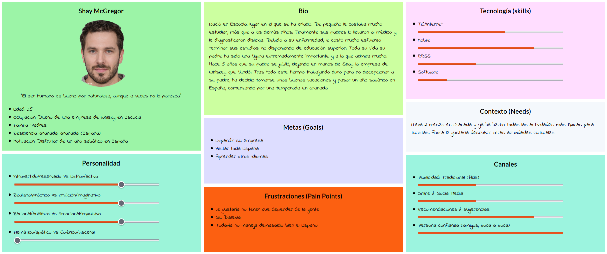
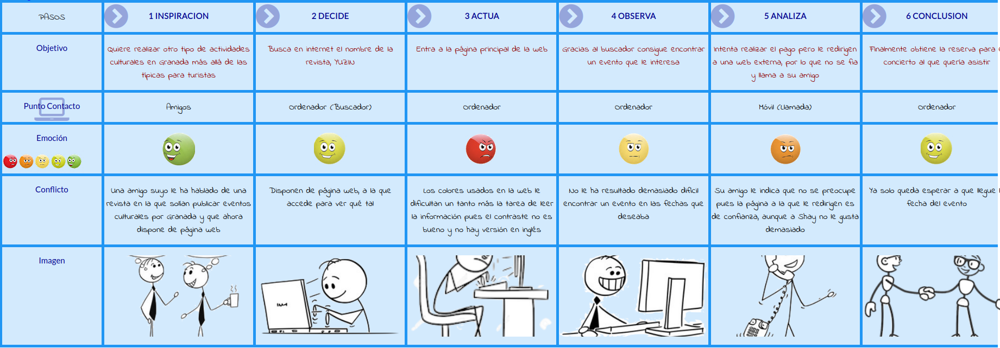

# DIU-TrabajoFinal2021
Ejercicio Final DIU\
Autor: Fernandez Alcaide, Alejandro

El trabajo consta de 2 partes.\
La primera consisten en una redacción de autoevaluación de todo el trabajo realizado durante la asignatura, en el que se recojan y expongan las actividades realizadas y los conceptos aprendidos con cada una.\
La segunda parte consisten en aplicar dichos conocimientos realizando un rediseño de la web [YUZIN](https://yuzin.com/) aplicando de forma libre las diferentes actividades aprendidas durante la asignatura, especialmente en las prácticas
## Parte I: Mi Experiencia UX
\
En este documento se expondrá mi experiencia UX adquirida durante el desarrollo de la asignatura. Las distintas secciones se irán exponiendo en orden cronológico respecto de su realización pues considero que es la mejor forma de exponer los conocimientos que se han ido adquiriendo, de forma que en las primeras actividades se vean claramente las carencias propias de ser la primera vez que me enfrentaba a temas como estos, y en la última se exponga la experiencia y técnicas aprendidas. Hablaremos principalmente de las prácticas y las 3 tareas entregables para teoría pues son las actividades a las que más tiempo he dedicado y que mejor recuerdo.\
\
*PRÁCTICA 1: ANÁLISIS DEL INTERFAZ DE USUARIO. REVISIÓN DE USABILIDAD*\
La P1 fue el primer contacto con la asignatura. Las partes de las que más he aprendido fueron los Journey Maps y el análisis de usabilidad. Gracias a realizar las personas y sus respectivos journey maps aprendimos en cierta forma a empatizar con otras personas. Durante la primera parte de la practica realizamos un análisis competitivo entre varias webs, pero la perspectiva de ese análisis era principalmente mi propia experiencia y opiniones al usar la web. Sin embargo, al crear y usar personas con características distintas a las nuestras propias aprendimos a analizar las cosas desde un punto de vista distinto. Por ejemplo, en mi caso realicé una persona con problemas de visión. Personalmente no tengo ningún problema con la vista, pero al tener que realizar el análisis de la web desde la perspectiva de alguien que sí los tiene pude ver problemas que la web tenía que en un primer análisis desde mi perspectiva no habría encontrado\
\
*Actividad 1: Etnografía*\
En esta actividad decidí observar a una amiga mía que se enfrentaba a jugar a Minecraft por primera vez. Al menos en mi caso, estoy ciertamente acostumbrado a estas situaciones de “etnografía” en la que observo gente que se encuentra con dificultades para usar objetos o dispositivos. Por ejemplo, en los primeros meses de funcionamiento del metro era común ver personas mayores que no sabían usar las máquinas y que al final acababan preguntadome a mi u otras personas para que las ayudasen. Sin embargo, lo que nunca había hecho era después de observar una situación como esta, plasmar los problemas observados formalmente en un documento. Esto me hizo aprender a observar estas situaciones desde un punto de vista más crítico, que permite identificar mejor los problemas con las interfaces de los objetos los cuales antes simplemente descartaba pensando “bueno, es gente mayor normal que no sepan usar cosas como esta”\
\
*PRÁCTICA 2 DISEÑO DE BOCETOS: Propuesta de App de Economía Colaborativa*\
Las actividades de las que más aprendí en esta práctica fueron las partes 4 (Task Analysis) en la que hicimos un User/Task Flow y 5 (Arquitectura de la Información) Cuando trabajábamos en esta práctica ya teníamos un poco más de experiencia analizando otros productos/aplicaciones, pero ahora era el momento de enfrentarnos al diseño de una aplicación por nosotros mismos. Al principio parecía una tarea intimidante pero al realizar estas 2 tareas aprendimos a estructurar la información de la aplicación y como esta se divide entre las diferentes pantallas de la aplicación y también como navegarán los usuarios por estas, aspecto también muy relevante para obtener un producto con buena usabilidad. Gracias a haber realizado estas dos actividades previamente, la fase de prototipado posterior fue bastante más sencilla pues disponíamos de una estructura aunque fuese aproximada de lo que queríamos hacer. Además, estas actividades han demostrado ser útiles en este mismo curso, pues en otra asignatura por ejemplo tuvimos que realizar una aplicación móvil y uno de los primeros pasos que dimos en el desarrollo de esa práctica fue realizar unos bocetos sencillo junto a un user/task Flow que mostrase la estructura de la aplicación, cosa que resultó útil tanto para nosotros durante el desarrollo como para los “clientes” que en este caso era el profesor que debía evaluar nuestra práctica el cual nos dijo que disponer de estos documentos le ayudó bastante a comprender nuestro trabajo\
\
*PRÁCTICA 3:  PROTOTIPADO / Mockup*\
De esta práctica me gustaría destacar la fase de diseño visual. La actividad recoge conceptos que más o menos ya conocía antes de cursar la asignatura, como la importancia de diseñar una paleta de colores y unas fuentes a emplear en el diseño de una aplicación de forma que se mantenga cierta coherencia visual e identidad de marca. Sin embargo, de nuevo, nunca me había enfrentado al hecho de tener que pensar yo mismo estos aspectos. Tuvimos que buscar una paleta de colores que nos gustase, estuviese relacionada con la temática de nuestra aplicación y además se apropiados en tanto que se obtuviese un diseño agradable, buenos contrastes, etc. También tuvimos que buscar fuentes para usar en nuestro proyecto. Aquí vimos la importancia también de usar una fuente adecuada. Aunque para el logo de nuestra aplicación, de temática nazarí, usamos una fuente (Khodijah) muy peculiar y de aspecto árabe (incluyo a continuación el logo desarrollado)\
\
Vimos rápidamente no obstante que esta fuente no era para nada apropiada para usarla en toda la aplicación, pues su legibilidad era bastante pobre en textos más largos y con un tamaño de fuente menor y también podía resultar cargante rápidamente, cosa que antes de haber cursado esta asignatura quizás ni siquiera nos habríamos planteado hasta haber tenido el prototipo completo y visualizado el resultado final\
\
*Actividad 2 y Práctica 4: Evaluación de Usabilidad*\
Agrupo esta actividad y práctica ya que tanto cronológicamente como en temática del contenido son similares. Consistieron en realizar un análisis de usabilidad de por un lado en la actividad de las webs de varias universidades andaluzas mientras que en la práctica era del trabajo de otros compañeros. Estos fueron de los últimos trabajos que hicimos para la asignatura, por lo que probablemente sean en los que más se nota los conocimientos y experiencia adquirida durante la asignatura. Aunque no sean exactamente lo mismo, si comparamos la experiencia haciendo estas tareas con las del análisis de la P1 se puede ver un cambio más que notable. En estos trabajos me sentí mas seguro del trabajo que estaba realizando, sabiendo mejor qué actividades se debían realizar y también identificando más fácilmente y mejor los problemas de usabilidad detectados en los productos evaluados.\
\
*Actividad 3:  Accesibilidad*\
Por ultimo tenemos la actividad relacionada con la accesibilidad que realizamos en clase. De nuevo, comparado con el análisis que hicimos en la P1 se nota de nuevo un progreso en mis conocimientos acerca de UX. Aprendimos por ejemplo a usar los simuladores de accesibilidad y a generar reportes automáticos de los criterios de accesibilidad web. Por un lado, mediante los simuladores y la experiencia adquirida con los demás análisis realizados en la asignatura pude identificar más fácilmente de lo que esperaba los problemas de accesibilidad de las webs. También al usar los evaluadores, aunque el trabajo se realiza automáticamente, el análisis de los resultados proporcionados dudo mucho que lo hubiese entendido e identificado de forma tan sencilla que antes de cursar la asignatura.\
\
*Conclusiones Finales*\
Como hemos visto durante el repaso de las distintas actividades realizadas, creo que durante el desarrollo de la asignatura he aprendido bastantes conceptos sobre diseño y UX los cuales espero demostrar correctamente realizando la tarea que se nos pide.
## Parte II: Caso de Estudio. YUZIN
### Paso 1. UX Desk Research & Analisis
Puesto que el objetivo del trabajo es realizar un rediseño de la web, lo primero que debemos hacer es analizar la solución actual, es decir, la web que nos presenta [YUZIN](https://yuzin.com/). Uno de los aspectos que nos presenta el trabajo es que la web ya experimentó recientemente un rediseño en el que se modificó tanto el aspecto visual de la web como su foco principal. Antes la web se centraba en la revista que Yuzin publica mensualmente en la que recogen eventos culturales en Granada y pasó a tener una orientación más digital, mostrando la web actual, y dejando la revista en un segundo plano. Por tanto, para conocer con qué trabajamos vamos a utilizar la herramienta [Wayback Machine](https://web.archive.org/) que nos permitirá ver de primera mano la versión antigua y así podremos comprender mejor la historia del sitio y lo que suponen los cambios realizados\

Podemos ver que se trata de una web completamente estática, lo cuál está completamente desfasado con respecto a las tendencias actuales. Si bien no se debe sobrecargar de dinamismo una web, tampoco es bueno que esta sea completamente estática. Con el diseño antiguo, la web era una herramienta de paso en la que los usuarios apenas pasarían tiempo pues no se les ofrece nada más que un escaparate mediante el cual acceder a la revista. Por tanto, considero adecuado haber realizado un rediseño de la web para aportarle mayor funcionalidad y en definitiva aportar algo de valor que haga que los usuarios quieran acceder a la web y pasar algo de tiempo en ella. No obstante, habrá que estudiar ahora como de bueno es el rediseño efectuado, identificar qué aspectos se podrían mejorar y finalmente exponer mi propuesta de (re)rediseño.\
Para el análisis de la propuesta actual se realizarán 3 tareas. Actuando como experto en UX, realizaré una evaluación heurística de la web para identificar los puntos fuertes y débiles. También se creará una persona ficticia que mediante un Journey Map usará la web y expondrá su experiencia. Finalmente, también se realizará una evaluación de la accesibilidad de la solución actual, pues también es un factor fundamental a considerar.
#### 1.1 Evaluación Heurística
Se aplicará la evaluación con respecto a los apartados contemplados en el documento [http://www.uxforthemasses.com/wp-content/uploads/2011/02/Usability-review-template.xls](http://www.uxforthemasses.com/wp-content/uploads/2011/02/Usability-review-template.xls) proporcionado en las prácticas de la asignatura.\
Para acceder al documento de la evaluación completo [pulse aqui](https://github.com/AlejandroFrndz/DIU-TrabajoFinal2021/blob/main/pdfs/Usability-review.pdf). Vemos que la web obtiene una valoración de 62 puntos. Esto quiere decir que en general ofrece buenas funcionalidades interesantes para los usuarios, desde luego más que la versión antigua que no ofrecía nada de interes, pero la web tiene espacio de mejora en materia de usabilidad.
#### 1.2 Persona y User Journey Map
En primer lugar, la persona que he diseñado para este analisis es Shay  Lo más relevante acerca de Shay y que puede mostrarnos una interacció no tan típica con la web es que por un lado es extranjero y aunque lleva un tiempo viviendo en Granada, todavía no domina bien el idioma por lo que preferiría disponer de una versión en inglés. Por otro lado, es una persona que sufre dislexia por lo que las opciones y aspectos de accesibilidad son muy importantes para que pueda hacer un uso satisfactorio del sitio\
En su Journey Map, Shay accede a la web y busca y reserva una asiento para un evento que le ha gustado  Vemos que en general la web es lo suficientemente usable como para completar el objetivo que los usuarios persiguen con ella, pero hay aspectos como la accesibilidad que necesitan una mejora para poder ser un proceso realmente satisfactorio para los usuarios
#### 1.3 Evaluación de la Accesibilidad
